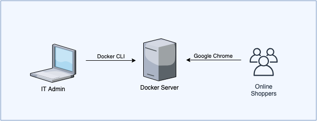
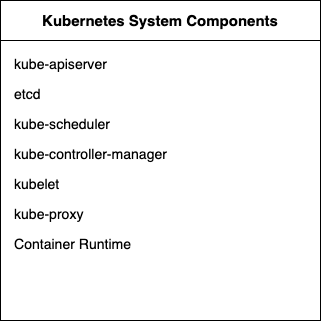
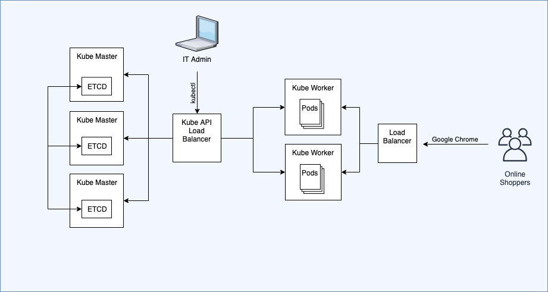

# architecture

At a fundamental level, Kubernetes is used for running containers. Docker can also do the same so might wonder, why Kubernetes when you have Docker?  

Theres a lot of reasons why, but let's take a look at one of those reason using the following example:

In this scenario we have a IT Admin who uses the docker cli to create a collection of containers on a docker server. The Docker server could a be on anything, a physical server, a VM on an on premise Data Center, a EC2 instance in AWS,..etc. These containers delibers a online ecommerce website that online shoppers can use to make purchases. Thre are 2 problems with this setup:

- You can only scale vertical, i.e. if the docker server is running out of cpu and ram, then you can only increase the cpu and ram of the existing docker server.  
- No HA. If docker server crashes then all containers die with it, and it can take several minutes to build a replacement docker server.

There are workarounds to this by building multiple docker servers and put them behind a Load balancer. However that will bring it's own set of problems, because Docker hasn't been designed to run work that way. What's needed is a container orchestration software, such as Docker swarm, our in our case Kubernetes. 

The Kubernetes software is made up over [several smaller self-contained components](https://kubernetes.io/docs/concepts/overview/components/) that all working together to deliver the Kubernetes solution. These components falls in of 2 categories, Master Components and Node Components.

The master components manakes the kube cluster as a whole, whereas Node components are responsible for the actual running of the pods. 

There's actually lots of different way to install kubernetes. One of the option is is to install all the components one a single node:

In Kubernetes, your containers run inside a Kubernetes construct called pods. 

This setup suffers from the same problems as our docker setup that we saw earlier, i.e. can only scale vertically, and no HA. That's why Kubernetes was developed with a modular design so that you can install a single Kubernetes instance that spans across multiple nodes, aka a **Kube Cluster**.

The **Kube Master** node houses all the components that manages the kube cluster as a whole. Whereas, the **kube worker** nodes houses the components that are responsible for the actual running of the pods.

This setup now allows for horizontal scaling, you just need to add another Kube worker to the cluster. Also if one of the kube worker dies, then the kube master will create pods in the other worker nodes to compensate for the lost pods. 

However this setup still has a single point of failure, which is the kube master itself. That's why in order to achieve HA you need to have multiple kube masters:

In fact that's how it's done when setting Kubernetes locally on your using minikube. 

However minikube presents the same problem. 

Draw diagram based on this info:

[https://kubernetes.io/docs/setup/independent/install-kubeadm/#check-required-ports](https://kubernetes.io/docs/setup/independent/install-kubeadm/#check-required-ports).

The Kubernetes software is not a single software, it is in fact a highly modular software that's made up of several independent components, this design is based on the microservice concept. Some of these components controls the actual internal runnings of kubernetes, whereas other components are responsible for running the actual containers. 

. You can install all these components on a single vm. Which is the case of minikube. 

However for Horizontal scaling and HA, it's best to run the ac

You can install all these components on a single machine, which is the case with minikube. But for better redundancies, HA, scalability it is better to install the components a cluster of vms. 

A production ready kuberenetes setup is made up of several servers. they are either:

- master nodes, aka controller nodes, control plane
- worker nodes - runs pods

Along with those, you also have:

- local workstation - this has kubectl installed on it. 
- loadbalancer - used to loadbalance kube-api data traffic to master nodes. In particular is forwards traffic to the kube-apiserver component. the traffic may originate from:
  - local workstations - when someone uses the kubectl command to perform tasks
  - The kubelet or kube-proxy components that are running inside worker nodes. 

In the container world, all (big) applications should be broken into smaller independent more moduler applications (aka microservice) which can communicated with one another using API calls. These microservices should run inside containers. Kubernetes software software itself.

When it comes to installing Kubernetes, 

### Terminology

master nodes are also known be other names, controllers, ... For the rest of this study guide I'll use the phrase master nodes, worker nodes, and kube cluster. 

## master nodes

Master nodes have the following components installed on them:

- etcd - this is a key/value datastore to store the current state of the kube cluster.
- [kube-apiserver](https://kubernetes.io/docs/reference/command-line-tools-reference/kube-apiserver/) - This is single binary that we run using a daemon. this recieves instructions from the kubectl cli tool
- kube-controller-manager
- kube-scheduler

## worker nodes

- containerd - main runtime engine used for runnng containers
- kubelet - receives instructions from master nodes about what pods should be running then sends instructions to containerd
- kube-proxy - manages networking across all worker nodes. It does:
  - dns 
  - Creates network overlay, so that each pod has it's own unique ip address